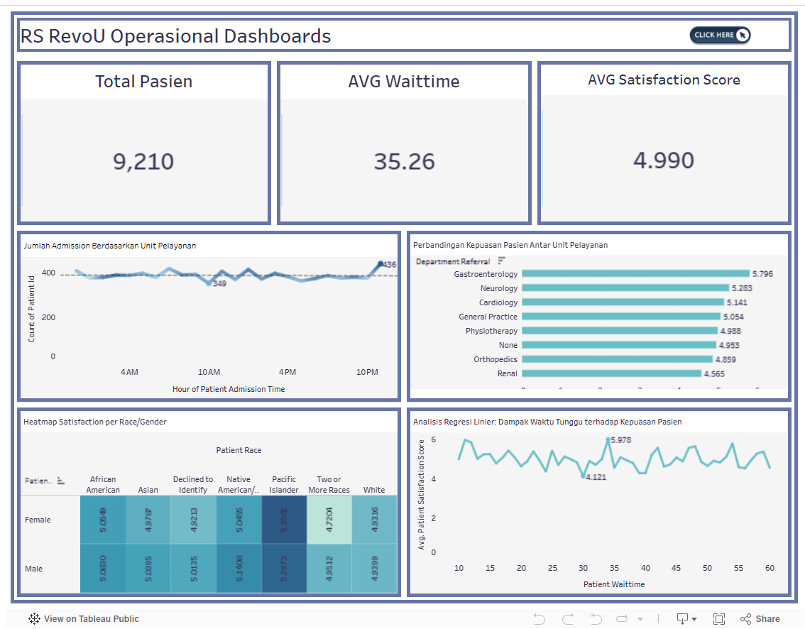

# Hospital Patient Experience & Operational Efficiency Analysis

## SECTION 1: PROJECT SUMMARY FOR PORTFOLIO
### Summary/Context
This project analyzes operational efficiency and patient experience quality at RevoU Hospital Type B from September 2023 to December 2024. The analysis addresses challenges from surging patient visits that potentially extend wait times, cause departmental workload imbalances, and decrease patient satisfaction levels.

### Goals
The primary goal is to transform raw data into strategic insights via a Business Intelligence dashboard to support management policies. The analysis focuses on identifying visit surge patterns for precise staff scheduling and evaluating the correlation between wait times and patient satisfaction scores.

### Process
The process began by extracting 9,219 rows of structured data (.CSV) from the Hospital Management Information System (SIMRS). Steps included data cleaning (removing duplicates and format standardization), profiling characteristics, and creating data visualizations using Tableau to monitor daily performance automatically.

### Output
Analysis shows an average hospital wait time of 35.26 minutes, with peak visits occurring at 00:00. Strategic recommendations include increasing staff during night shifts (22:00 – 01:00), conducting internal audits of the Neurology unit to reduce wait time bottlenecks, and hospitality training in the Renal unit to improve low satisfaction scores.

## SECTION 2: SCOPE OF WORK / ACHIEVEMENTS (AQS FRAMEWORK)
- Analyzed 9,217 rows of patient visit data for 2023-2024 to identify operational patterns and factors influencing satisfaction.
- Cleaned the dataset by removing duplicates and standardizing 17 gender typos to ensure 100% data validity.
- Developed an interactive Tableau dashboard to monitor patient arrival fluctuations reaching a peak of 436 visits at midnight.
- Provided strategic recommendations to maintain wait times under 35 minutes to prevent significant drops in patient satisfaction.

## SECTION 3: TOOLS & METHODS
### A. Tools
- Spreadsheet
- Google Sheets
- Tableau

### B. Methods
- Data Cleaning
- Data Profiling
- Descriptive Statistics
- Data Integration
- Data Aggregation
- Linear Regression Analysis

### Interactive Dashboard
View the interactive Tableau dashboard here: https://public.tableau.com/app/profile/venny.deslaweny

### Dataset Source:
https://docs.google.com/spreadsheets/d/1V7ut_DBW5pZDIUd-DeCWSstFEmS9-DDjI8ZjKR6nClI/edit?gid=2077642394#gid=2077642394

## SECTION 4: VISUAL SUGGESTIONS
- Horizontal Bar Chart: Displays wait time comparisons per department to highlight the Neurology unit as having the highest bottleneck.
- Line Chart (Peak Hours): Visualizes patient arrival fluctuations throughout the day, showing extreme surges at 12 AM.
- Heatmap: Shows satisfaction levels by race and gender to identify groups with the lowest satisfaction scores.
- Scatter Plot & Trend Line: Displays the correlation between wait time duration and the decline in patient satisfaction through regression analysis.
- Interactive Dashboard: An integrated view of all key operational metrics for RevoU Hospital to enable real-time management monitoring.

## BUSINESS IMPACT
The analysis provides actionable insights for hospital management:
- Reducing average wait times below 35 minutes to maintain high patient satisfaction levels.
- Optimizing staff allocation during peak hours (22:00–01:00).
- Identifying high-pressure departments such as Neurology that require operational improvements.
- Implementing real-time dashboard monitoring to support data-driven hospital management decisions.

## Key Insight
An analysis of 9,219 patient visit records revealed that hospital operational efficiency is significantly impacted by extreme arrival surges at 00:00 (436 visits), resulting in an average wait time of 35.26 minutes. While the Renal unit recorded the fastest service duration, it surprisingly yielded the lowest satisfaction scores, whereas the Neurology unit was identified as the primary bottleneck with the highest wait times. These findings indicate a strong correlation between wait duration and declining patient satisfaction, leading to strategic recommendations for staff redistribution during night shifts (22:00 – 01:00), process audits within the Neurology unit, and hospitality training for the Renal unit to ensure service standards consistently remain below the 35-minute threshold.

## Dashboard Preview

## Project Files
- Hospital-Patient-Experience-Analytics-Dataset.csv — raw hospital visit data
- Hospital-Patient-Experience-Analytics-Dashboard.png — Tableau dashboard preview
- Hospital_dashboard.twbx — interactive Tableau dashboard

## Author
Venny Amilia Deslaweny
